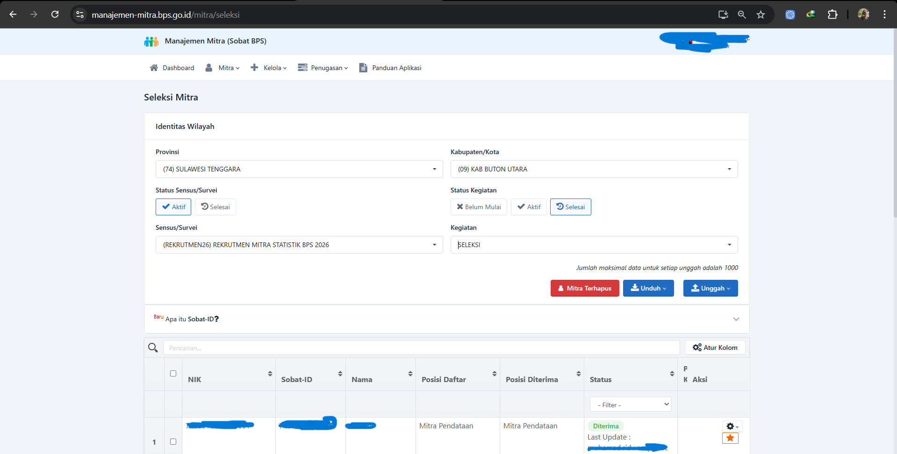

# 🤖 Scraping Manajemen Mitra BPS

> **Tool otomatis untuk mengambil data mitra dari website BPS dengan bantuan AI**

Aplikasi ini akan membantu Anda mengambil data mitra (NIK, rekening, ijazah, dll) dari sistem Manajemen Mitra BPS secara otomatis. Data akan disimpan dalam format Excel yang rapi dan mudah dibaca.

---

## 📖 Daftar Isi

- [🎯 Apa yang Bisa Dilakukan?](#-apa-yang-bisa-dilakukan)
- [🛠️ Persiapan Awal](#️-persiapan-awal)
- [🚀 Cara Menggunakan](#-cara-menggunakan)
- [📊 Hasil Output](#-hasil-output)
- [🐛 Troubleshooting](#-troubleshooting)
- [❓ FAQ (Pertanyaan Umum)](#-faq-pertanyaan-umum)

---

## 🎯 Apa yang Bisa Dilakukan?

Tool ini akan:

1. ✅ **Mengambil data mitra** dari website BPS secara otomatis
2. ✅ **Download foto KTP dan Ijazah** setiap mitra
3. ✅ **Membaca ijazah dengan AI** untuk mendapatkan:
   - Nama lengkap dengan gelar
   - Jenis pendidikan (SMA/SMK atau Perguruan Tinggi)
   - Gelar akademik (S.Kom, S.E., dll)
   - NIM, Program Studi, Fakultas, Universitas
4. ✅ **Menyimpan semua data** dalam file Excel yang rapi
5. ✅ **Membersihkan nomor rekening** (hanya angka)
6. ✅ **Otomatis mendeteksi mismatch** data (Baris merah di Excel jika data aneh)


**Hasil:** Anda akan mendapat file Excel berisi semua data mitra yang lengkap!

---

## 🛠️ Persiapan Awal

### **Langkah 1: Install Python**

1. Download Python dari: https://www.python.org/downloads/
2. Install Python (centang "Add Python to PATH")
3. Buka Command Prompt, ketik: `python --version`
4. Jika muncul versi Python, berarti sudah berhasil!

### **Langkah 2: Download Project**

**Opsi A: Pakai Git**
```bash
git clone https://github.com/alwanrahmanas/scraping-manajemen-mitra.git
cd scraping-manajemen-mitra
```

**Opsi B: Download ZIP**
1. Klik tombol hijau "Code" di GitHub
2. Pilih "Download ZIP"
3. Extract file ZIP
4. Buka folder hasil extract

### **Langkah 3: Install Dependencies**

Double-click file: **`setup.bat`**

Tunggu sampai selesai. Jika berhasil, akan muncul pesan "Setup selesai!"

### **Langkah 4: Dapatkan API Key OpenAI**

1. Buka: https://platform.openai.com/api-keys
2. Login atau daftar akun OpenAI
3. Klik "Create new secret key"
4. Copy API key yang muncul

### **Langkah 5: Setup API Key**

1. Buka file **`.env.example`**
2. Copy isinya
3. Buat file baru bernama **`.env`** (tanpa .example)
4. Paste dan ganti `your_api_key_here` dengan API key Anda:
   ```
   OPENAI_API_KEY=sk-proj-xxxxxxxxxxxxx
   ```
5. Simpan file

**✅ Persiapan selesai!** Anda siap menggunakan tool ini.

---

## 🚀 Cara Menggunakan

### **PENTING: Sebelum Mulai**

1. **Buka Chrome** dengan cara khusus:
   - Double-click: **`start_chrome.bat`**
   - Chrome akan terbuka dengan mode khusus (jangan tutup!)

2. **Login ke website BPS:**
   - Buka halaman "Seleksi Mitra"
   - Login dengan akun Anda
   - Pastikan halaman tabel mitra sudah terbuka

3. **Jangan tutup Chrome** selama proses scraping!

---
## 📸 Contoh Tampilan Aplikasi Manajemen Mitra



---

### **Cara 1: Testing (3 Data Pertama)** 👍 Recommended untuk pemula

Double-click: **`run_test.bat`**

**Apa yang terjadi:**
- Tool akan mengambil **3 data pertama** saja
- Proses sekitar 2-3 menit
- Hasil disimpan di folder: `output_test_YYYYMMDD_HHMMSS/`

**Gunakan ini untuk:**
- ✅ Coba pertama kali
- ✅ Test apakah tool berjalan dengan baik
- ✅ Lihat contoh hasil output

---

### **Cara 2: Full Scraping (Semua Data)** ⚡

Double-click: **`run.bat`**

**Apa yang terjadi:**
- Tool akan mengambil **SEMUA data** di tabel
- Proses bisa lama (tergantung jumlah data)
- Hasil disimpan di folder: `output_YYYYMMDD_HHMMSS/`

**Gunakan ini untuk:**
- ✅ Ambil semua data mitra
- ✅ Produksi / data final

---

### **Proses Berjalan**

Saat tool berjalan, Anda akan lihat:

```
========================================
SCRAPING MITRA BPS - TESTING MODE
========================================

Connecting to Chrome (port 9222)...
✓ Connected to: Seleksi Mitra : Manajemen Mitra

Processing Row 1: NIK 7410011110800001
✓ Popup opened
✓ Clicked File Administrasi tab
Found KTP link: https://...
✓ Downloaded: ktp.jpg
Found Ijazah link: https://...
✓ Downloaded: ijazah.jpg
Parsing ijazah dengan OpenAI Vision API...
✓ Ijazah parsed successfully
✓ Clicked Rekening tab
Found Nama Bank: BRI
Found Nomor Rekening: 1234567890
✓ Row processed successfully

--- Progress: 1/3 ---
```

**Jangan tutup window ini!** Biarkan sampai selesai.

---

## 📊 Hasil Output

### **Struktur Folder**

Setelah selesai, Anda akan dapat folder seperti ini:

```
output_test_20260106_143000/
├── mitra_data_test.xlsx    ← File Excel (buka ini!)
├── mitra_data_test.csv     ← Backup CSV
└── downloads/              ← Folder foto
    ├── 7410011110800001/
    │   ├── ktp.jpg         ← Foto KTP
    │   └── ijazah.jpg      ← Foto Ijazah
    ├── 7410036005020001/
    └── ...
```

### **Isi File Excel**

File Excel berisi kolom-kolom berikut:

| Kolom | Penjelasan | Contoh |
|-------|------------|--------|
| **NIK** | Nomor Induk Kependudukan | 7410011110800001 |
| **Nama Lengkap (dengan Gelar)** | Nama + gelar dari ijazah | JOHN DOE, S.Kom |
| **Nomor Rekening** | Nomor rekening (hanya angka) | 1234567890 |
| **Nama Bank** | Nama bank | BRI |
| **Nama Pemilik Rekening** | Nama pemilik rekening | JOHN DOE |
| **Jenis Ijazah** | SMA/SMK atau Perguruan Tinggi | Perguruan Tinggi |
| **Gelar** | Gelar akademik | S.Kom |
| **NIM** | Nomor Induk Mahasiswa | 123456789 |
| **Program Studi** | Jurusan kuliah | Teknik Informatika |
| **Fakultas** | Fakultas | Teknik |
| **Universitas** | Nama universitas | Universitas Indonesia |
| **Tanggal Ijazah** | Tanggal kelulusan | 2020-08-15 |
| **Path KTP** | Lokasi file KTP | downloads/.../ktp.jpg |
| **Path Ijazah** | Lokasi file ijazah | downloads/.../ijazah.jpg |
| **Status** | Status proses | Success |

**Buka file Excel dengan Microsoft Excel atau Google Sheets!**

---

## 🐛 Troubleshooting

### **Error: "No suitable tab found"**

**Penyebab:** Chrome tidak berjalan dengan mode khusus

**Solusi:**
1. Tutup semua window Chrome
2. Double-click: `start_chrome.bat`
3. Login ke website BPS
4. Jalankan lagi `run_test.bat`

---

### **Error: "OPENAI_API_KEY not found"**

**Penyebab:** File `.env` belum dibuat atau API key salah

**Solusi:**
1. Pastikan ada file `.env` (bukan `.env.example`)
2. Buka file `.env`
3. Pastikan isinya seperti ini:
   ```
   OPENAI_API_KEY=sk-proj-xxxxxxxxxxxxx
   ```
4. Ganti `sk-proj-xxxxxxxxxxxxx` dengan API key Anda
5. Simpan file

---

### **Error: "Timeout waiting for popup"**

**Penyebab:** Internet lambat atau website BPS lambat

**Solusi:**
- Coba lagi (kadang website BPS lambat)
- Pastikan internet stabil
- Refresh halaman website BPS

---

### **Parsing Ijazah Gagal (Kolom Gelar Kosong)**

**Penyebab:** Foto ijazah buram atau tidak jelas

**Solusi:**
1. Cek foto ijazah di folder `downloads/[NIK]/ijazah.jpg`
2. Jika foto jelas tapi tetap gagal, coba re-parse:
   ```bash
   python reparse_single.py [NIK]
   ```
   Contoh: `python reparse_single.py 7410036005020001`
3. Jika masih gagal, isi manual di Excel

---

### **Chrome Tiba-Tiba Tertutup**

**Penyebab:** Chrome di-close manual atau crash

**Solusi:**
1. Buka Chrome lagi dengan: `start_chrome.bat`
2. Login ke website BPS
3. Jalankan ulang scraping

---

## ❓ FAQ (Pertanyaan Umum)

### **Q: Berapa lama proses scraping?**

**A:** Tergantung jumlah data:
- Testing (3 data): ~2-3 menit
- Full (100 data): ~30-40 menit
- Full (1000 data): ~5-6 jam

### **Q: Berapa biaya OpenAI API?**

**A:** Sekitar $0.01 - $0.02 per ijazah (sangat murah!)
- 100 ijazah = ~$1-2
- 1000 ijazah = ~$10-20

### **Q: Apakah data aman?**

**A:** Ya! Semua data disimpan di komputer Anda sendiri. Tidak ada yang dikirim ke server lain kecuali foto ijazah ke OpenAI untuk di-parse (dan langsung dihapus setelah selesai).

### **Q: Bisa dijalankan di Mac/Linux?**

**A:** Bisa, tapi file `.bat` harus diganti dengan script shell. Hubungi developer untuk bantuan.

### **Q: Bisa pause dan lanjut lagi?**

**A:** Tidak bisa pause. Jika berhenti di tengah jalan, data yang sudah diambil akan tersimpan, tapi harus mulai dari awal lagi untuk data yang belum.

### **Q: Hasil Excel bisa diedit?**

**A:** Bisa! Buka dengan Excel/Google Sheets dan edit sesuka hati.

### **Q: Bisa scraping website lain?**

**A:** Tidak. Tool ini khusus untuk website Manajemen Mitra BPS.

---

## 📞 Butuh Bantuan?

Jika ada masalah yang tidak tercantum di sini:

1. **Cek file log** di folder project (file `.log`)
2. **Screenshot error** yang muncul
3. **Hubungi developer** dengan info:
   - Screenshot error
   - File log
   - Langkah yang sudah dicoba

---

## 📝 Catatan Penting

⚠️ **Jangan:**
- Tutup Chrome saat scraping berjalan
- Tutup Command Prompt saat scraping berjalan
- Klik-klik di website BPS saat scraping berjalan
- Share API key OpenAI ke orang lain

✅ **Lakukan:**
- Biarkan Chrome dan Command Prompt terbuka
- Tunggu sampai proses selesai
- Cek hasil di folder output
- Backup file Excel hasil scraping

---

## 🎉 Selamat Menggunakan!

Jika berhasil, Anda akan mendapat file Excel berisi data lengkap semua mitra!

**Happy Scraping! 🚀**

---

## 👨‍💻 Developer

**Alwan Rahmana S**
- GitHub: [@alwanrahmanas](https://github.com/alwanrahmanas)

---

## 📄 Changelog

### v2.0.0 (2026-01-06)
- ✨ AI-powered ijazah parsing
- ✨ Auto versioning dengan timestamp
- ✨ Deteksi jenis ijazah (SMA/SMK vs PT)
- ✨ Regex cleaning nomor rekening
- 🐛 Fix download KTP & Ijazah
- 🐛 Fix tab selection
- 📖 Dokumentasi lebih jelas

### v1.0.0 (2026-01-05)
- 🎉 Initial release
